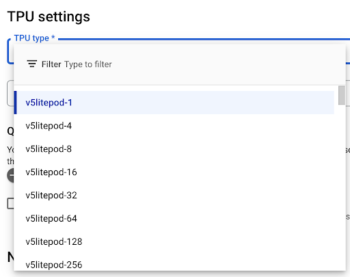
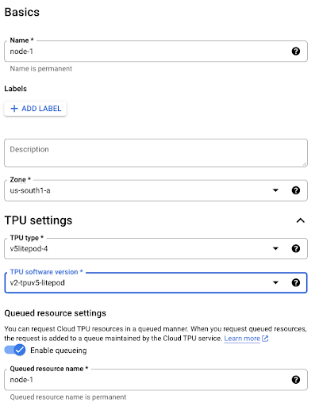
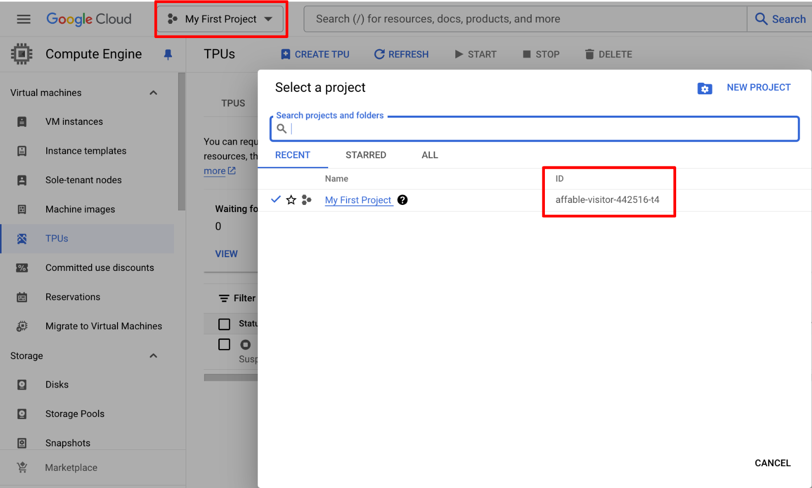
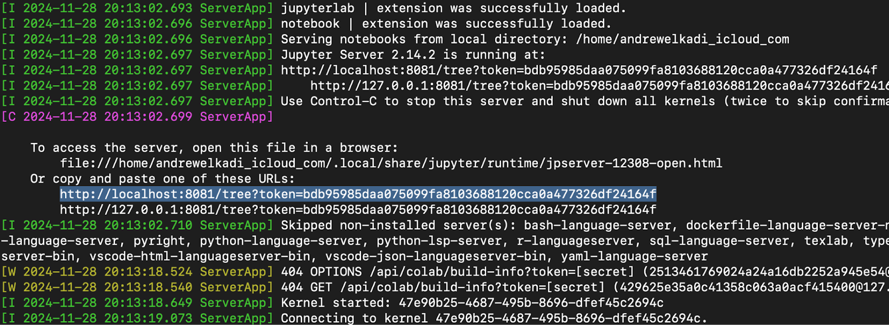
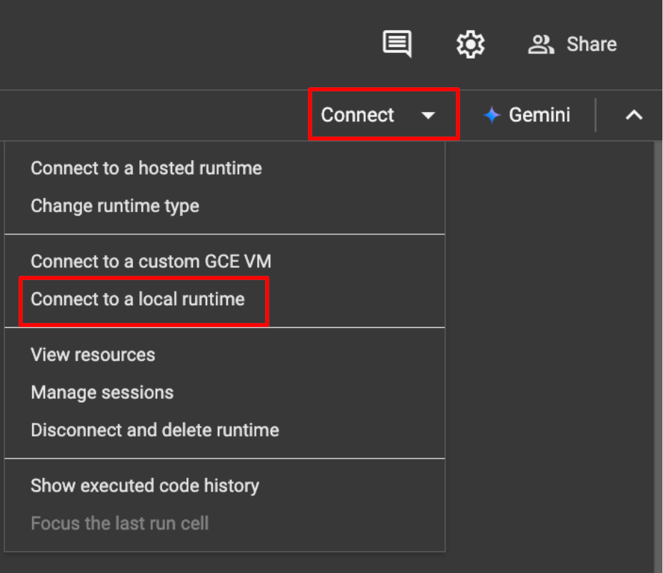

This document describes how to run `gencast_demo_cloud_vm.ipynb` through [Colaboratory](https://colab.research.google.com/github/deepmind/graphcast/blob/master/gencast_demo_cloud_vm.ipynb) using Google Cloud compute.

## TPU Cost and Availability

- There are 2 ways to access a Cloud TPU VM:
  - "Spot"
    - As per https://cloud.google.com/tpu/docs/spot, "Spot VMs
      make unused capacity available at highly-discounted rates. Spot VMs can be
      preempted (shut down) at any time… You can't restart TPU Spot VMs, and you
      must recreate them after preemption."
  - "On Demand"
      - As per https://cloud.google.com/tpu/docs/quota#tpu_quota,
      "On-demand resources won't be preempted, but on-demand quota does not
      guarantee there will be enough available Cloud TPU resources to satisfy
      your request."
- N.B. you may come across references to "preemptible" TPUs, these have been
  [deprecated](https://cloud.google.com/tpu/docs/preemptible)
- As per https://cloud.google.com/compute/docs/instances/spot#pricing,
  "Spot prices give you 60-91% discounts compared to the standard price for most
  machine types and GPUs."
- As per https://cloud.google.com/tpu/pricing, at the time of
  writing, "On Demand" prices (price pre-discount applied above) are:
  - v4p: ~$3.20 per chip hour
  - v5e: ~$1.20 per chip hour
  - v5p: ~$5.20 per chip hour
- Reference pricing, estimating ~10 minutes for TPU set up/data transfer
  - v5e: 4 sample, 30 step rollout of 1deg GenCast takes ~5 minutes, including
    tracing and compilation, this will cost ~ 15 (minutes) * 1.20 ($/chip hour) *
    1/60 (minutes to hour) * 4 (chips) * 0.09-0.4 (discount) = $0.11 - $0.48
    - Once the TPU is set up and compilation/tracing is done, the same rollout
      takes ~3 minutes = $0.07 - $0.29
  - v5p: 8 sample, 30 step rollout of 0.25deg GenCast takes ~30 minutes,
    including tracing and compilation, this will cost ~ 40 (minutes) * 5.20
    ($/chip hour) * 1/60 (minutes to hour) * 8 (chips) * 0.09-0.4 (discount) =
    $2.50 - $11.10
    - Once the TPU is set up and compilation/tracing is done, the same rollout
      takes ~8 minutes = $0.50 - $2.22

## GenCast Memory Requirements

### Running inference on TPU

- This requires:
  - 0.25deg GenCast: ~250GB of Host RAM (System Memory) and ~32GB of HBM (vRAM)
  - 1deg GenCast: ~21GB of Host RAM (System Memory) and ~8GB of HBM (vRAM)
- Host RAM/System Memory is required for compilation. One way of accessing
  sufficient host memory is to request a multi-device host, such as a 2x2x1
  configuration of TPUs
- HBM/vRAM is required for running inference. Each TPU in a 2x2x1 TPUv4p+
  configuration has enough HBM to run GenCast inference. As such, we make
  efficient use of all devices and parallelise generating an ensemble across
  them
- Note that compilation cost does not increase with the number of devices, it is
  a fixed-cost one time operation whose result can be reused across any number
  of devices

### Running Inference on GPU

- Inference can also be run on GPU, however, splash attention is currently not
  supported for GPU in JAX
- Instead, inference must be run with a model whose `SparseTransformerConfig` has
  ```
  attention_type = "triblockdiag_mha"
  mask_type = "full"
  ```
  set.
   - To do this with one of the pre-trained checkpoints provided, load the model
     and override the config
     ```
     with ... as f:
        ckpt = checkpoint.load(f, gencast.CheckPoint)
        ...
        denoiser_architecture_config = ckpt.denoiser_architecture_config
        denoiser_architecture_config.sparse_transformer_config.attention_type = "triblockdiag_mha"
        denoiser_architecture_config.sparse_transformer_config.mask_type = "full
     ```

**Skill comparison vs. TPU**
- We tried running the model on a H100 using the `triblockdiag_mha` attention implementation and found that,  while the performance is comparable, there is a small degradation (on average ~0.3% on unbiased Ensemble Mean RMSE and ~0.4% on unbiased CRPS).  For reference, a scorecard comparing GenCast forecasts produced on a TPUv4 with `splash attention` vs. on a H100 with `triblockdiag_mha`  can be found in [docs/](https://github.com/google-deepmind/graphcast/blob/main/docs/GenCast_0p25deg_accelerator_scorecard.png).   Note that this scorecard differs from those found in the GenCast paper in a number of ways:
    - 8 member ensembles (vs. 50 in the paper)
    - 30 hour initialisation strides starting from 01-01-2019T00, i.e. a comparison
      of 292 initialisations (vs. 730 in the paper)
    - Colorbar limits of +-3% (vs. +-20% in the paper)
- There are two possible sources of this discrepancy. The first is the fact that the `splash` and `triblockdiag_mha` attention implementations are not exactly numerically equivalent (despite being algebraically equivalent). We have tested the isolated impact of these numerical differences by comparing performance with each attention implementation, both running on TPU. This comparison (scorecard [here](https://github.com/google-deepmind/graphcast/blob/main/docs/GenCast_0p25deg_attention_implementation_scorecard.png)) shows that there is very little difference caused by numerical differences between attention implementations. This implies that the minor degradation is caused primarily by running on GPU instead of TPU, and our initial investigations suggest that the root cause is the difference in the default precision of matmul operations on GPU compared to TPU.


**Memory requirement comparison vs. TPU**
- `triblockdiag_mha` also requires more memory, as such running inference on GPU
  requires:
  - 0.25deg GenCast: ~300GB of System Memory and ~60GB of vRAM
  - 1deg GenCast: ~24GB of System Memory and ~16GB vRAM

**Inference time comparison vs. TPU**

- We have observed that running inference on H100 is slower than expected. Specifically we saw that a 30-step rollout of 0.25deg GenCast takes ~8min on TPUv5 with `splash_attention` (once compiled) whereas it takes ~25min on GPU with `triblockdiag_mha` attention.
- Part of this runtime discrepancy is caused by the fact that using `triblockdiag_mha` attention makes inference ~2x slower, such that running on TPU with `triblockdiag_mha` takes about ~15min, compared to the ~8min using `splash_attention`. However, there remains a discrepancy between the ~15min on a TPU and ~25min on GPU when using `triblockdiag_mha`.

## Prerequisites

### Create a Google Cloud account

- This can be done via https://cloud.google.com/
- Creating an account will prompt you to enter credit card information
  - While this is necessary, please note that Google Cloud provides $300 worth
    of free credits to start with, for 90 days. As per Cloud: "You won't be
    auto-charged once your trial ends. **However, your resources are marked for
    deletion and may be lost immediately**. Activate your full account anytime
    during your trial to avoid losing your resources. After activating your full
    account, you'll pay only for what you use."
- This will create a project by default

### Set up `gcloud` on your personal device

- Install `python` https://www.python.org/downloads
- Install `gcloud` CLI https://cloud.google.com/sdk/docs/install
  and follow instructions to initialise
    - Don't forget to restart your terminal once you have completed this to enable
    `gcloud`

## Provisioning a Cloud VM TPU

- In what follows, set fields:
  - Name: as preferred, we will assume they are the same and refer to them as
    `<name>` from here on
  - Zone: at the time of writing, for each TPU type, availability can be found
    in
    - v4p: None ☹️
    - v5e: `us-south1-a` or `asia-southeast1-b`
    - v5p: `us-east5-a` or `europe-west4-b`
    - Note that availability is variable and subject to change - we will refer to this
    as `<zone>` from here on
  - TPU type: based on the GenCast model being run, number of chips N desired and quota limits.
    - The "GenCast Memory Requirements" section above details the accelerator recommendation for each model, where, in the TPU type dropdown:
      - v5e → `v5litepod-N`
      - v5p → `v5p-N`
      - e.g. 
    - The number of chips `N` will correspond to the number of forecasts samples that can be generated in parallel
    - Some zones have limits on number of chips that can be requested, e.g. at the time of writing `us-south1-a` limits to `v5litepod-4`
    - Some TPU types have restrictions on the minimum number of chips that can be request, e.g. at the time of writing v5p appears to come in a minimum 8 chip configuration: `v5p-8`
  - TPU software version: based on the TPU type
    - v5e: `v2-tpuv5-litepod`
    - v5p: `v2-alpha-tpuv5`
- Enabling "queueing" puts the creation request into a queue until resources become available. If you do not select this then if capacity is not instantaneously available at the time of the creation request, it will result in a `Stockout` error
- After creating the instance, you will find your request in the Console on "Compute Engine>TPUs>Queued Resources" tab
  - Its status should change to "provisioning" and eventually "active"

**NOTE**: if you see a failed job in Queued Resources, you may have to delete it before launching again. This is because it is considered as quota and may cause you to hit the quota ceiling. Fortunately, this will not consume credits.

Summary:

|          Model         | Recommended Accelerator |               Cells               | Software Version |   |
|:----------------------:|:-----------------------:|:---------------------------------:|:----------------:|:-:|
| GenCast 0p25deg (Oper) |          v5p-N          |    us-east5-a or europe-west4-b   |  v2-alpha-tpuv5  |   |
|   GenCast 1deg (Mini)  |       v5litepod-N       | us-south1-a or asia-southeast1-b  | v2-tpuv5-litepod |   |

**OPTION 1: Via the command line (required if requesting "Spot" TPUs)**:

- As per https://cloud.google.com/tpu/docs/spot#create-tpu-spot-vms
- If enabling queueing, set fields as above, and set
  - `QUEUED_RESOURCE_ID` = `<name>`
  - `node_id` = `<name>`
  - `accelerator-type` = desired TPU type e.g. `v5litepod-4`
  - `runtime-version` = desired TPU software version e.g. `v2-tpuv5-litepod`
- If not enabling queuing, set fields as above, and set
  - `TPU_NAME` = `<name>`
  - `accelerator-type` = desired TPU type e.g. `v5litepod-4`
  - `version` = desired TPU software version e.g. `v2-tpuv5-litepod`
- To request a spot device, append `--spot` to the command
- E.g.
  ```
  gcloud compute tpus queued-resources create node-1 --node-id=node-1 --zone=us-south1-a --accelerator-type=v5litepod-4 --runtime-version=v2-tpuv5-litepod --spot
  ```

**OPTION 2: Via the Cloud Console**:

- In the Cloud console sidebar, navigate to "Create a VM>Compute Engine" and then to "TPUs" in the menu on the left
  - On the first visit this will prompt you to "Enable" Compute Engine API"
- Click "Create TPU"
- Set fields as above
  - N.B. The UI presents the option "Management>Preemptibility>Turn on pre-emptibility for this TPU node"
    - This is actually a deprecated field and will result in a `Preemptibility is not available for the selected zone and type` error
    - To request "Spot" TPUs see the command line method above
  - Enable queuing by toggling the provided "Enable queuing" button
- E.g. 


## Preparing an "active" Cloud VM TPU

- SSH into the TPU VM and port forward to your personal device
  ```
  gcloud compute tpus tpu-vm ssh --zone <zone> <name> --project <project> -- -L 8081:localhost:8081
  ```
  - Where `<project>` can be found in the Cloud Console, e.g. 
- Transfer relevant files onto the VM (this is required because as per https://github.com/googlecolab/colabtools/issues/2533, mounting Google Drive or Cloud Buckets is not possible in local runtimes), e.g. to run a 30 step rollout of the 1 degree model
    ```
    gcloud storage cp gs://dm_graphcast/gencast/dataset/source-era5_date-2019-03-29_res-1.0_levels-13_steps-30.nc .
    gcloud storage cp "gs://dm_graphcast/gencast/params/GenCast 1p0deg <2019.npz" .
    gcloud storage cp --recursive gs://dm_graphcast/gencast/stats/ .
    ```
- Install
  - JAX, to ensure the proper runtime libraries are installed to access the TPUs
    ```
    pip install -U "jax[tpu]" -f https://storage.googleapis.com/jax-releases/libtpu_releases.html
    ```
  - Jupyter, to launch a local runtime server
    ```
    pip install jupyter
    ```

### (Optional) Set up a bucket to store predictions

- Now that the zone of the TPU is known, create a bucket, where
  - `<bucket_name>` is as preferred
  - `<location>` is the zone used for the TPU, using the names listed as per https://cloud.google.com/storage/docs/locations#available-locations,
    - E,g, `us-south1-a` → `US-SOUTH-1`
  ```
  gcloud storage buckets create gs://<bucket_name> --location <location>
  ```
- Create a Cloud TPU service account
  ```
  gcloud beta services identity create --service tpu.googleapis.com --project <project>
  ```
  - The above command returns a Cloud TPU Service Account with following format (we refer to this as `<service_account>`):
    ```
    service-<project_number>@cloud-tpu.iam.gserviceaccount.com
    ```
- Grant writing permissions
  ```
  gcloud storage buckets add-iam-policy-binding gs://<bucket_name> --member=serviceAccount:<service_account> --role=roles/storage.objectCreator
  ```
- You can view the bucket in the Console UI by visiting Storage>Buckets in the sidebar

## Connecting Notebook to a prepared Cloud VM TPU

- While still SSHd to the TPU VM, start the Jupyter server
  ```
  python3 -m notebook --NotebookApp.allow_origin='https://colab.research.google.com' --port=8081 --NotebookApp.port_retries=0 --no-browser
  ```
  - This will generate a http://localhost… URL, e.g. http://localhost:8081/tree?token=bdb95985daa075099fa8103688120cca0a477326df24164f
    
- Connect to the local runtime in gencast_demo_cloud_vm.ipynb with this URL
  
- Happy forecasting! (Don't forget to delete the TPU VM once done)
  

## (Optional) Transferring data off of the TPU

- Run the "Save the predictions" cell in the notebook to save the predictions to the TPU filesystem
  ```
  # @title (Optional) Save the predictions.
  predictions.to_zarr("predictions.zarr")
  ```
- In the command line copy these predictions to the bucket created as per the instructions above
  ```
  gcloud storage cp --recursive predictions.zarr gs://<bucket_name>/
  ```

